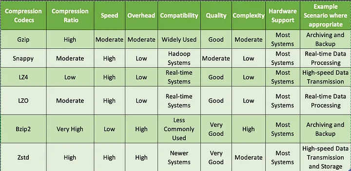
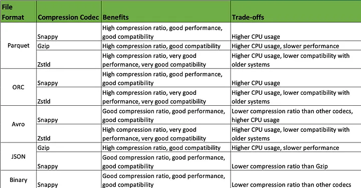
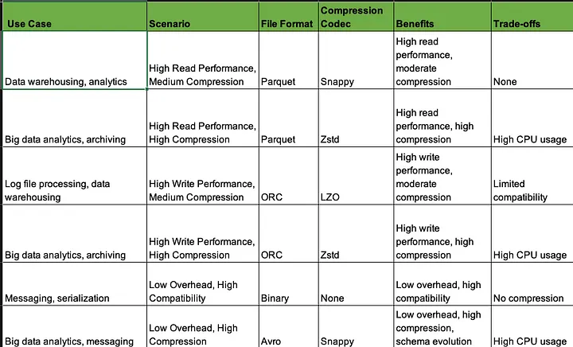

# What is compression ?
Compression is used to reduce the size of data by removing redundancy, without sacrificing the quality or information  
content of the data.  
Compression codecs, also known as compression algorithms or compression schemes, are software programs or libraries  
that are used to compress and decompress data. These codecs use mathematical techniques to encode and decode data,  
allowing it to be transmitted, stored, or processed more efficiently.

Here are some parameters to keep in mind as:
- Compression Ratio
- Speed
- Overhead
- Compatibility
- Quality
- Complexity
- Hardware Support 

There are several different compression codecs available as:

- __Gzip:__ A widely used codec that provides good compression ratios and is compatible with most systems.
- __Snappy:__ A fast codec that provides moderate compression ratios and is commonly used in Hadoop systems.
- __LZ4:__ A fast codec that provides low compression ratios but is ideal for real-time systems.
- __LZO:__ A fast codec that provides moderate compression ratios and is commonly used in real-time systems.
- __Bzip2:__ A slower codec that provides high compression ratios but is less commonly used due to its slower speed.
- __Zstandard (Zstd):__ A relatively new codec that provides high compression ratios and is commonly used in systems  
  that require both high performance and high compression.

__Gzip provides high compression ratios but is slow, making it suitable for offline data compression where speed is  
not critical.__  

__Snappy and LZ4 are fast codecs suitable for real-time systems that require low overhead and fast  
compression/decompression speeds.__  

__Bzip2 provides very high compression ratios but at the cost of high overhead and slow speed, making it suitable for  
scenarios where data storage is more important than real-time processing.__  

__Zstd is a relatively new codec that provides high compression ratios and fast compression/decompression speeds,  
making it suitable for systems that require both high performance and high compression__

__Note:__ that the compression codecs available depend on the file format you are using, so be sure to check the  
documentation for the specific file format you are working wit  

# File Format With Compression
