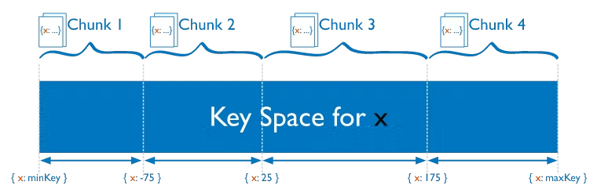
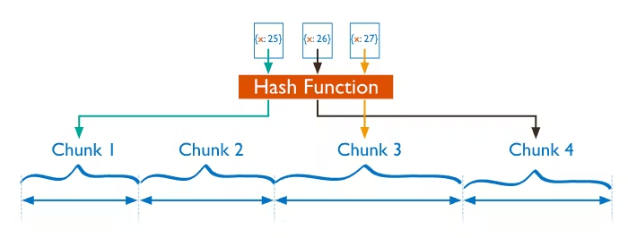

# What is Sharding?
Sharding is a method for distributing or partitioning data across multiple machines.
It is useful when no single machine can handle large modern-day workloads, by allowing you to scale horizontally.
Horizontal scaling, also known as scale-out, refers to adding machines to share the data set and load.  
Horizontal scaling allows for near-limitless scaling to handle big data and intense workloads.

# Sharding Benefits
Sharding allows you to scale your database to handle increased loads to a nearly unlimited degree.  
It does this by increasing read/write throughput, and storage capacity. Let’s look at each of those  
in a little more detail:

- __Increased read/write throughput:__ You can take advantage of parallelism by distributing the data set across  
  multiple shards. Let’s say one shard can process one thousand operations per second. For each additional shard,  
  you would gain an additional one thousand operations per second in throughput.

- __Increased storage capacity:__ Similarly, by increasing the number of shards, you can also increase overall total  
  storage capacity. Let’s say one shard can hold 4TB of data. Each additional would increase your total storage by 4TB.  
  This allows near-infinite storage capacity.

- __Data Locality:__ Zone Sharding allows you to easily create distributed databases to support geographically  
  distributed apps, with policies enforcing data residency within specific regions. Each zone can have one or more shards.

- __High availability:__ Finally, shards provide high availability in two ways. First, since each shard is a replica  
  set, every piece of data is replicated. Second, even if an entire shard becomes unavailable since the data is  
  distributed, the database as a whole still remains partially functional, with part of the schema on different shards.

# Disadvantages of sharding
Sharding does come with several drawbacks, namely overhead in query result compilation, complexity of administration,  
and increased infrastructure costs.

- __Query overhead:__ Each sharded database must have a separate machine or service which understands how to route a  
  querying operation to the appropriate shard. This introduces additional latency on every operation. Furthermore,  
  if the data required for the query is horizontally partitioned across multiple shards, the router must then query  
  each shard and merge the result together. This can make an otherwise simple operation quite expensive and slow down response times.
- __Complexity of administration:__ With a single unsharded database, only the database server itself requires upkeep  
  and maintenance. With every sharded database, on top of managing the shards themselves, there are additional service  
  nodes to maintain. Plus, in cases where replication is being used, any data updates must be mirrored across each  
  replicated node. Overall, a sharded database is a more complex system which requires more administration.
- __Increased infrastructure costs:__ Sharding by its nature requires additional machines and compute power over  
  a single database server. While this allows your database to grow beyond the limits of a single machine,  
  each additional shard comes with higher costs. The cost of a distributed database system, especially if it is  
  missing the proper optimization, can be significant.

# Sharding Strategy
Below are two general sharding strategies for distributing data across sharded clusters:

- __Ranged Sharding:__ Ranged sharding divides data into ranges based on the shard key values. Each chunk is then  
  assigned a range based on the shard key values. A range of shard keys whose values are “close” are more likely to  
  reside on the same chunk. This allows for targeted operations as a database can route the operations to only the  
  shards that contain the required data.  

- __Hashed Sharding:__ Hashed Sharding involves computing a hash of the shard key field’s value. Each chunk is then  
  assigned a range based on the hashed shard key values. While a range of shard keys may be “close”, their hashed  
  values are unlikely to be on the same chunk. Data distribution based on hashed values facilitates more even data  
  distribution, especially in data sets where the shard key changes monotonically. However, hashed sharding does not  
  provide efficient range-based operations.  
